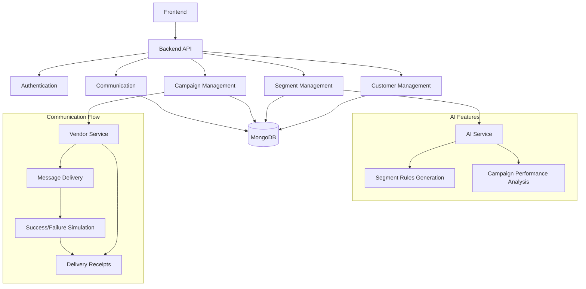

# CRM Backend System

A robust backend system for customer relationship management, featuring AI-powered segmentation, campaign management, and automated communication.

## Architecture



## Tech Stack

### Core Technologies
- **Backend Framework**: Node.js with Express
- **Database**: MongoDB with Mongoose ODM
- **Authentication**: Passport.js with JWT
- **API Documentation**: Swagger/OpenAPI

### AI Integration
- **AI Provider**: Google Generative AI (Gemini)
- **AI Features**:
  - Natural Language to Segment Rules Conversion
  - Campaign Performance Analysis
  - Smart Customer Segmentation

### Communication
- **Message Delivery**: Simulated Vendor API
- **Delivery Tracking**: Real-time status updates
- **Batch Processing**: Optimized for large-scale operations

## Local Setup

### Prerequisites
- Node.js (v14 or higher)
- MongoDB (v4.4 or higher)
- Google Cloud Account (for AI features)

### Environment Variables
Create a `.env` file in the root directory:
```env
# Server Configuration
PORT=3000
MONGODB_URI=mongodb://localhost:27017/crm_db

# Authentication
JWT_SECRET=your_jwt_secret
SESSION_SECRET=your_session_secret

# Google AI
GOOGLE_API_KEY=your_google_api_key

# Vendor API (for simulation)
VENDOR_API_URL=http://localhost:3001/api/vendor
```

### Installation Steps
1. Clone the repository:
   ```bash
   git clone https://github.com/yourusername/crm_backend.git
   cd crm_backend
   ```

2. Install dependencies:
   ```bash
   npm install
   ```

3. Start MongoDB:
   ```bash
   mongod --dbpath /path/to/data/directory
   ```

4. Start the development server:
   ```bash
   npm run dev
   ```

5. Run tests:
   ```bash
   npm test
   ```

## API Endpoints

### Authentication
- `POST /api/auth/login` - User login
- `POST /api/auth/register` - User registration
- `GET /api/auth/check` - Check authentication status

### Customers
- `POST /api/ingest/customers` - Single customer ingestion
- `POST /api/ingest/customers/batch` - Batch customer ingestion
- `GET /api/customers` - List customers
- `GET /api/customers/:id` - Get customer details

### Segments
- `POST /api/segments` - Create segment
- `POST /api/segments/generate-rules` - Generate rules from natural language
- `GET /api/segments` - List segments
- `GET /api/segments/:id` - Get segment details

### Campaigns
- `POST /api/campaigns` - Create campaign
- `GET /api/campaigns` - List campaigns
- `GET /api/campaigns/:id` - Get campaign details with AI summary

### Communication
- `POST /api/ingest/orders` - Single order ingestion
- `POST /api/ingest/orders/batch` - Batch order ingestion
- `POST /api/delivery-receipts` - Process delivery receipt
- `POST /api/delivery-receipts/batch` - Process batch delivery receipts

## Known Limitations

### AI Features
1. **Segment Rules Generation**:
   - Limited to predefined fields (totalSpend, visitCount, lastPurchase)
   - Natural language understanding may not handle complex queries perfectly
   - Date-based rules are limited to days and months

2. **Campaign Performance Analysis**:
   - Summary generation is limited to basic metrics
   - No predictive analytics for campaign success
   - Limited historical data analysis

### Communication System
1. **Message Delivery**:
   - Vendor API is simulated (90% success rate)
   - No real SMS/Email integration
   - Limited message personalization options

2. **Batch Processing**:
   - Fixed batch size of 50 messages
   - No automatic retry mechanism
   - Limited error recovery options

### Data Management
1. **Customer Data**:
   - No data validation for phone numbers
   - Limited customer profile fields
   - No duplicate detection

2. **Order Processing**:
   - Basic order structure
   - No inventory management
   - Limited payment processing

